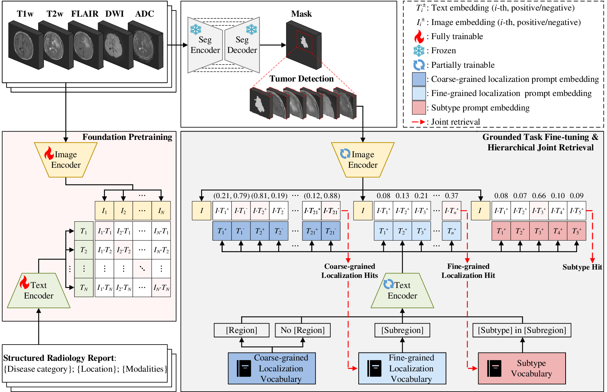
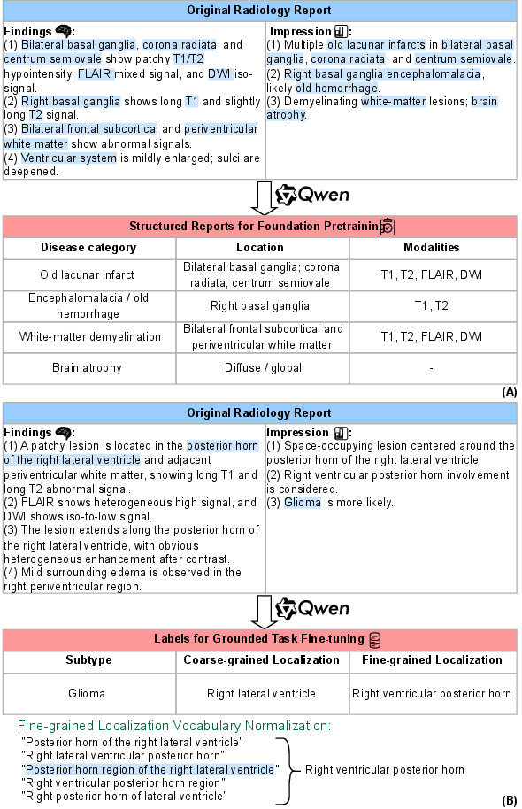
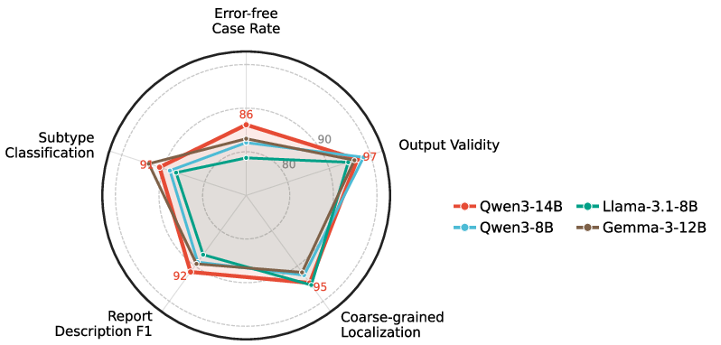
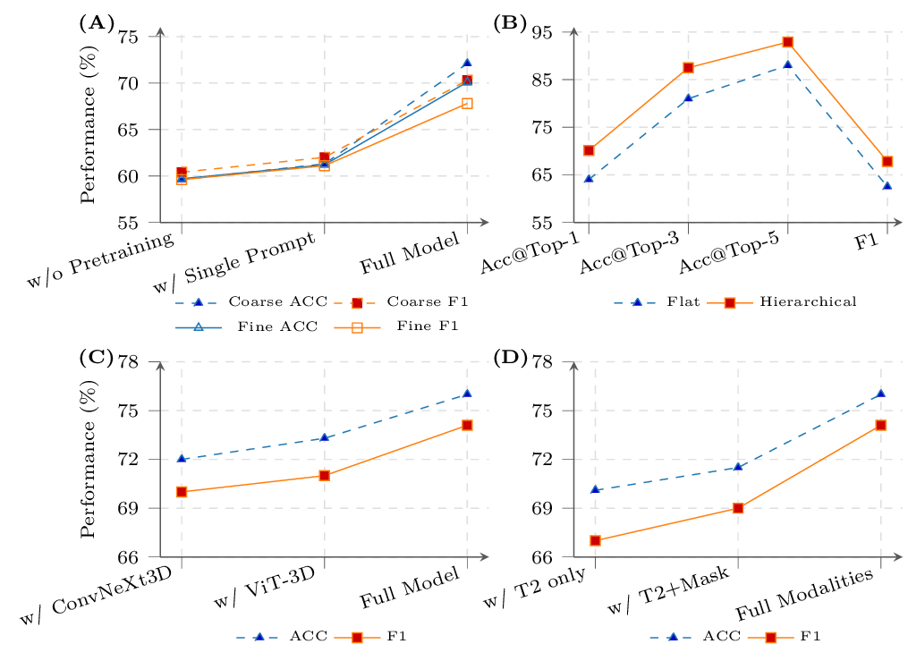
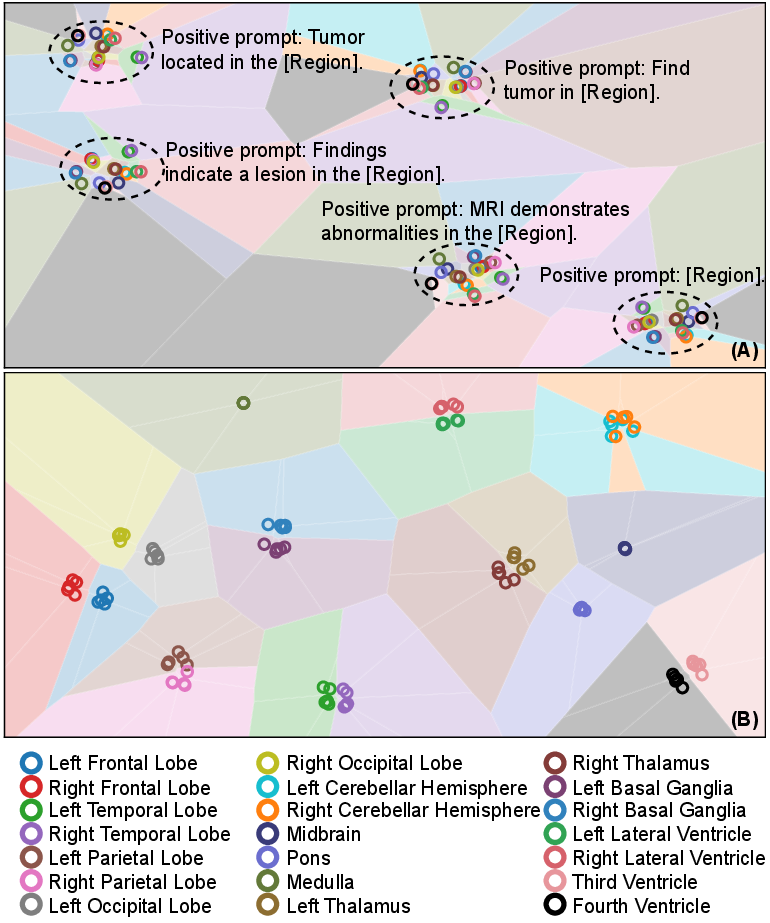
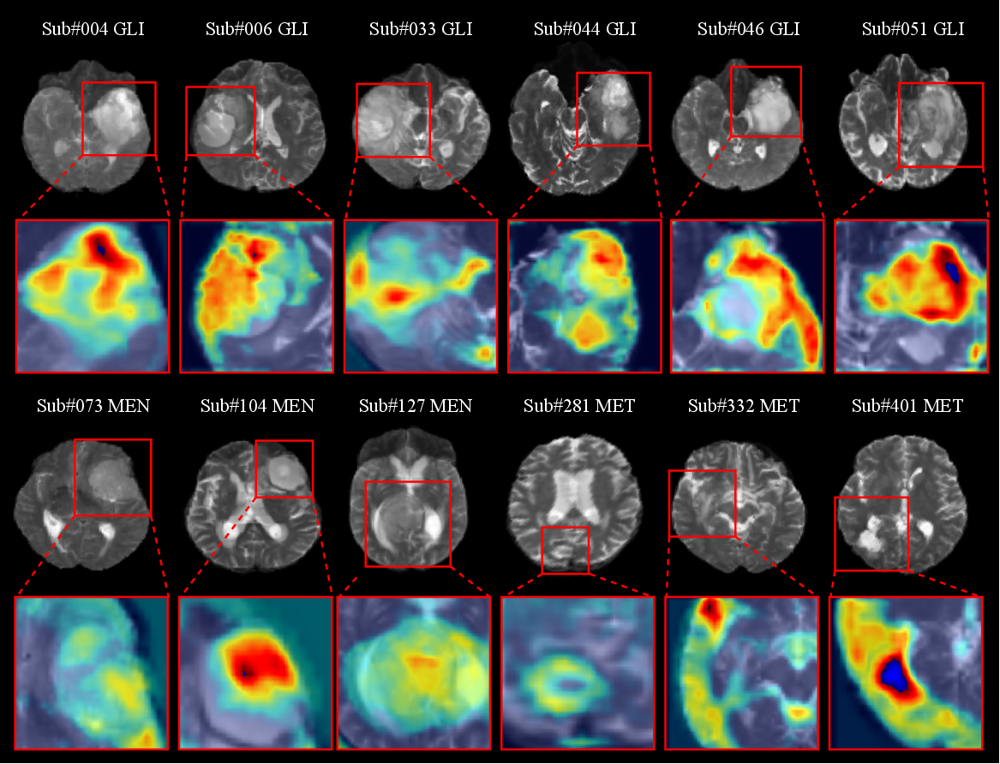

# LIGHT

**Learning Image-Text Grounding for Hierarchical Brain Tumor Localization and Subtype Classification in Multimodal MRI**

This repository will host the code, documentation, sample data, and reproducible assets for LIGHT. The project is under active preparation; the current version provides a lightweight public scaffold with manuscript figures and release placeholders.

## Overview

LIGHT formulates brain tumor localization and subtype classification as a unified image-text retrieval problem. Given multimodal brain MRI, the model retrieves human-readable anatomical and subtype prompts for hierarchical tumor localization and subtype prediction.

The core idea is to replace separate task-specific prediction heads with a shared retrieval vocabulary. Coarse localization, fine-grained localization, and subtype classification are represented as text prompts, and the model learns to align MRI features with these prompt embeddings. This makes the prediction space explicit and easier to inspect than a conventional closed classifier output.

This repository is being prepared for release. At this stage, it provides the project structure, manuscript figures, data-access notes, and placeholders for code, checkpoints, and examples.

## Framework



LIGHT combines multimodal MRI encoding with text-side anatomical and subtype prompts. The model is trained to align image features with human-readable prompt embeddings, so localization and subtype classification can be expressed as retrieval over explicit clinical concepts.

The framework contains two main stages. First, large-scale image-report pretraining learns MRI-report alignment from structured radiology reports. Second, grounded task fine-tuning uses localization and subtype prompts to perform hierarchical joint retrieval. A frozen segmentation prior provides a lesion-centered crop, while the final predictions are produced by image-text similarity rather than by the segmentation module.

## Repository Layout

```text
LIGHT/
+-- assets/
|   +-- figures/          # README figures and source PDFs
|       +-- source/       # Source PDFs copied from the manuscript
+-- checkpoints/          # Model checkpoints or download instructions
+-- data/                 # Data access notes and sample metadata
+-- docs/                 # Extra documentation
+-- examples/             # Minimal usage examples
+-- scripts/              # Utility scripts
+-- src/                  # Core implementation
```

## Results

### Dataset And Validation Summary



The study includes in-house, external clinical, and public validation cohorts. This figure summarizes the cohort composition and the role of each dataset in localization, subtype classification, and public validation experiments.

The release will document public-dataset preprocessing and sample metadata separately. Private clinical MRI data will not be redistributed, but the repository will provide enough structure for reproducing the public validation pipeline and adapting the method to local institutional cohorts.

### LLM-Assisted Label Validation



Structured report information is used to support label construction. The validation figure summarizes the manual review process and the agreement of LLM-assisted extraction with expert-verified labels.

The intended workflow separates report structuring from downstream model evaluation. LLM-derived candidates are manually checked before they are used as training labels, and this validation is reported independently from the final localization and subtype-classification results.

### Ablation Summary



The ablation study evaluates the contribution of foundation pretraining, prompt design, model components, and modality settings. Numerical result tables will be added after the final manuscript values are locked.

### Qualitative Examples



The embedding visualization provides a qualitative view of how image-text grounding separates anatomical or subtype concepts in the learned representation space.



The attention visualization illustrates the regions that contribute to the retrieved localization and subtype hypotheses.

## Figure Sources

The README images are rendered as white-background PNG files for readability in both light and dark GitHub themes. Original manuscript PDFs are kept in [`assets/figures/source`](assets/figures/source) for later replacement or higher-resolution export.

## Installation

The full environment file will be released with the implementation. A provisional setup flow is:

```bash
git clone https://github.com/qiuzhaoyu/LIGHT.git
cd LIGHT
conda create -n light python=3.10
conda activate light
pip install -r requirements.txt
```

## Data

Clinical data cannot be redistributed directly. Public data links, sample metadata, and preprocessing notes will be documented in [`data/data.md`](data/data.md).

## Code Release Plan

- [ ] Preprocessing scripts
- [ ] Prompt vocabulary construction
- [ ] Model definition
- [ ] Training and evaluation scripts
- [ ] Checkpoint/download instructions
- [ ] Sample data and inference demo

## Citation

Citation information will be added after publication.

## Contact

For questions, please open an issue or contact the repository maintainer.
