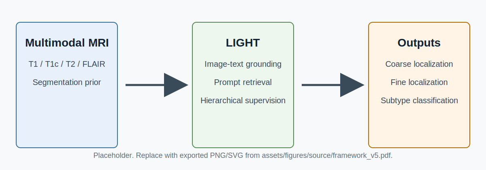
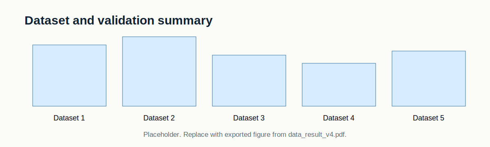
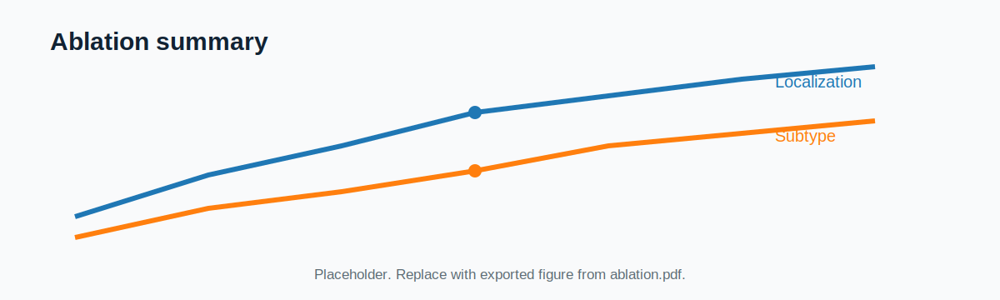
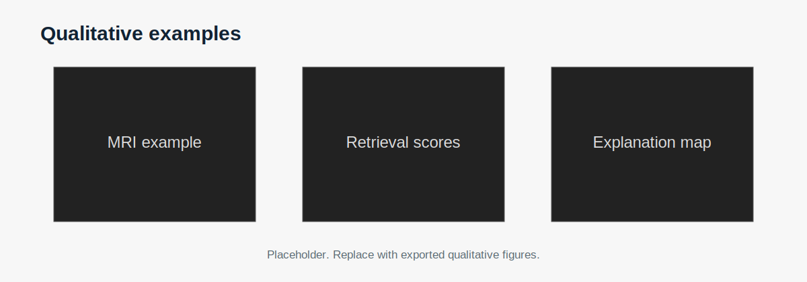

# LIGHT

**Learning Image-Text Grounding for Hierarchical Brain Tumor Localization and Subtype Classification in Multimodal MRI**

This repository will host the code, documentation, sample data, and reproducible assets for LIGHT. The project is under active preparation; the current version provides the public-facing structure and placeholders for the full release.

## Overview

LIGHT formulates brain tumor localization and subtype classification as a unified image-text retrieval problem. Given multimodal brain MRI, the model retrieves human-readable anatomical and subtype prompts for hierarchical tumor localization and subtype prediction.

## Framework



Source figure: [`assets/figures/source/framework_v5.pdf`](assets/figures/source/framework_v5.pdf)

## Repository Layout

```text
LIGHT/
+-- assets/
|   +-- figures/          # README figures and source PDFs
|   +-- tables/           # Markdown/CSV result tables
+-- checkpoints/          # Model checkpoints or download instructions
+-- data/                 # Data access notes and sample metadata
+-- docs/                 # Extra documentation
+-- examples/             # Minimal usage examples
+-- scripts/              # Utility scripts
+-- src/                  # Core implementation
```

## Results

### Dataset And Validation Summary



Source figure: [`assets/figures/source/data_result_v4.pdf`](assets/figures/source/data_result_v4.pdf)

### Main Quantitative Results

| Task | Dataset | Metric | LIGHT | Notes |
| --- | --- | ---: | ---: | --- |
| Coarse localization | Dataset 1 | ACC / F1 | TBD | Patient-wise cross-validation |
| Fine localization | Dataset 1 | Top-1 / Top-3 / Top-5 | TBD | 563-region retrieval vocabulary |
| Subtype classification | Dataset 1 | ACC / F1 | TBD | 3D multimodal setting |
| Subtype classification | Dataset 2 | ACC / F1 | TBD | External clinical validation |
| Public 2D validation | Dataset 4/5 | ACC / F1 | TBD | Complementary public validation |

Additional editable tables are collected in [`assets/tables/results.md`](assets/tables/results.md).

### Ablation And Qualitative Examples



Source figure: [`assets/figures/source/ablation.pdf`](assets/figures/source/ablation.pdf)



Source figures:
[`qualitative_results_3_v4.pdf`](assets/figures/source/qualitative_results_3_v4.pdf),
[`qualitative_results_4_v5.pdf`](assets/figures/source/qualitative_results_4_v5.pdf)

## Installation

The full environment file will be released with the implementation. A provisional setup flow is:

```bash
git clone https://github.com/qiuzhaoyu/LIGHT.git
cd LIGHT
conda create -n light python=3.10
conda activate light
pip install -r requirements.txt
```

## Data

Clinical data cannot be redistributed directly. Public data links, sample metadata, and preprocessing notes will be documented in [`data/data.md`](data/data.md).

## Code Release Plan

- [ ] Preprocessing scripts
- [ ] Prompt vocabulary construction
- [ ] Model definition
- [ ] Training and evaluation scripts
- [ ] Checkpoint/download instructions
- [ ] Sample data and inference demo

## Citation

Citation information will be added after publication.

## Contact

For questions, please open an issue or contact the repository maintainer.
